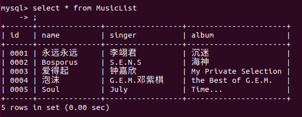
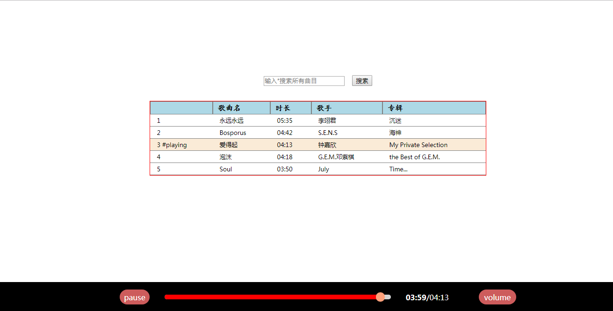

# WebMusic
## 运行方法
* 部署后端的数据库和音乐资源，并开启Web API服务
* 修改前端项目中的 src/configurations.js 中的服务器IP和端口
* 在前端项目目录下执行命令 `$ npm start`
***
## 后端部署
* MySQL曲目信息表<br>
<br>
**注意:** 表中的id值要与对应音乐资源名称一致<br><br>
* 目录
```
-- web-music-server.js
-- music_resources/
  -- 0001.mp3
  -- 0002.mp3
  -- 0003.mp3 ... ...
```
* web-music-server.js ( 需修改MySQL的登录信息 )
```js
/* 开启后端API服务的NodeJS代码 */

const mysql = require("mysql");
const express = require("express");
const app = express();

// Static resources that are allowed to be obtained directly
app.use(express.static(__dirname + "/static_resources"));

// Handle requests with certain music name for a music list
app.get("/scripts/music_list", (req, res, next) => {
	const connection = mysql.createConnection({
		"host": "localhost",
		"user": "root",
		/*"password": "112233",*/
		"database": "MUSIC"
	});
	connection.connect();
	const musicName = req.query.musicName;
	let sql = "SELECT * FROM MusicList WHERE name LIKE '%" + musicName + "%'";
	if (musicName === "*") {
		sql = "SELECT * FROM MusicList";
	}
	connection.query(sql, (error, results) => {
		if (error) {
			res.sendStatus(404);
			throw error;
		} else {
			res.set("Access-Control-Allow-Origin","*");
			res.json(results);
		}
	});
	connection.end();
});

// Handle requests with certain music id for a music file
app.get("/scripts/music_file", (req, res, next) => {
	const fileName = req.query.musicId + ".mp3";
	const options = {
		root: __dirname + "/music_resources/"
	};
	res.set("Access-Control-Allow-Origin","*");
	res.sendFile(fileName, options, (err) => {
		if (err) {
			console.log(err);
			res.status(err.status).end();
		} else {
			console.log(fileName + " sent successfully !");
		}
	});
});

const server = app.listen(3000, () => {
	console.log(
`\nWeb Music Server is listening at http:\/\/${server.address().address}:\
${server.address().port}`
	);
});
```

***
## 应用截图

